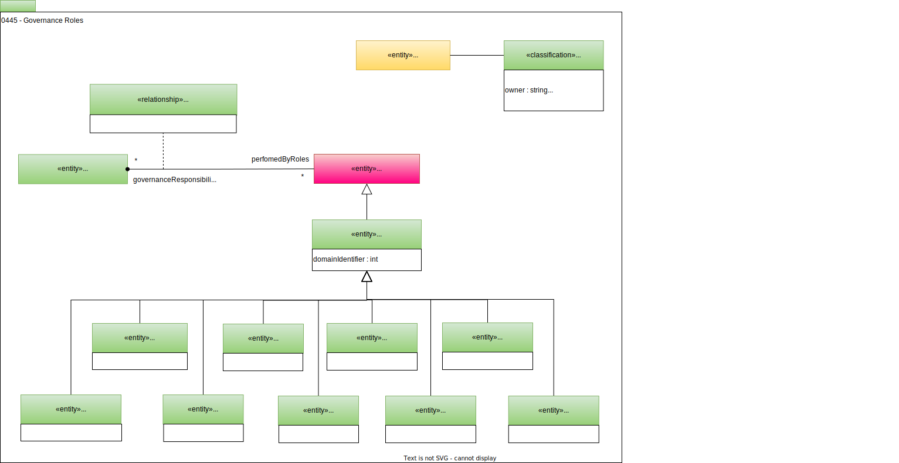

---
hide:
- toc
---

<!-- SPDX-License-Identifier: CC-BY-4.0 -->
<!-- Copyright Contributors to the ODPi Egeria project. -->

# 0445 Governance Roles

Although we aim to automate governance as much as possible, it is often necessary to
assign responsibility for specific actions to specific people.

In Figure 1, the responsibilities of someone assigned to manage a
particular aspect of governing a resource or related element ([Referenceable](/types/0/0010-Base-Model))
is represented by a *GovernanceRole* entity.
Since *GovernanceRole* inherits from [PersonRole](/types/1/0112-People)
an individual is assigned the Governance Role through the [PersonRoleAppointment](/types/1/0112-People)
relationship.

> Figure 1: Assignment of Governance Roles

Specific subtypes for GovernanceRole are also defined to group governance roles into the typical types of responsibility.

* *GovernanceOfficer* - person leading a governance domain.
* *GovernanceRepresentative* - Describes an advisor or representative from a governance domain that is working with other roles to help them with their governance tasks.
* *LocationOwner* - Describes a role that has specific responsibilities with respect to a [location](/types/0/0025-Locations).
* *BusinessOwner* - Describes a role that has specific responsibilities with respect to a [business area or service](/types/4/0440-Organization-Controls).
* *SolutionOwner* - Describes a role that has specific responsibilities with respect to a [solution](/types/7/0740-Solution-Blueprints).
* *AssetOwner* - Role responsible for the correct management of an [asset](/types/0/0010-Base-Model).
* *SubjectAreaOwner* - person responsible for the definitions within a [subject area](/types/4/0425-Subject-Areas).
* *ComponentOwner* - person responsible for a component such as a [software module](/type/2/0281-Software-Modules).
* *DataItemOwner* - person responsible for the correctness of a particular type of data value throughout its lifetime.  Often these data values flow between systems and the DataItemOwner must be sure it is correct in all places.

*Ownership* is assigned to a resource by adding the *Ownership* classification to it. This classification can assign ownership as an [ActorProfile](/1/0110-Actors), [UserIdentity](/types/1/0110-Actors) or [PersonRole](/types/1/0112-People).
It does not need to be a *GovernanceRole*.

??? deprecated "Deprecated types"
    - *ResponsibilityStaffContact* relationship is deprecated in favour of the more generic [*PersonRoleAssignment*](/types/1/0112-People).
    - *GovernanceRoleAssignment* relationship is deprecated in favour of the more generic [*AssignmentScope*](/types/1/0120-Assignment-Scopes).
    - The original ownership types did not allow resources to be owned by a person role. They are all replaced by the more generic *Ownership* classification.

        - *AssetOwnership* - use *Ownership*
        - *AssetOwnerType* - use *Ownership* properties
        - *OwnerType* - use *Ownership* properties

--8<-- "snippets/abbr.md"