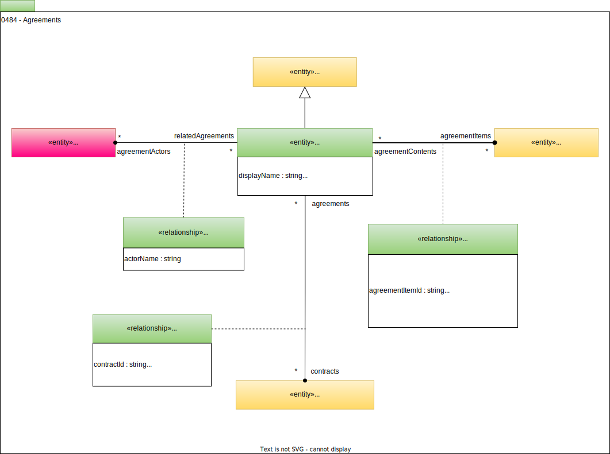

<!-- SPDX-License-Identifier: CC-BY-4.0 -->
<!-- Copyright Contributors to the ODPi Egeria project. -->

# 0484 Agreements

Agreements are used to record agreements between parties

## Agreement entity

An *Agreement* entity represents an agreement between parties.  This could be anything from an informal agreement to a legal binding contract.  The type of agreement is indicated by the *agreementType* property.  The terms and conditions of the agreement can be attached with the [AttachedTermsAndConditions](/types/4/0483-Terms-And-Conditions) relationship.

## ContractLink relationship

The *ContractLink* relationship links in the [ExternalReference](/types/0/0115-Linked-Media-Types) that identifies the location of an associated contract.

## AgreementItem relationship

The *AgreementItem* relationship identifies an element (any [Referenceable](/types/0/0010-Base-Model)) that is a part of the agreement.  For example, the *Agreement* may represent the End User License Agreement (EULA) for a user of a data product marketplace.  The *AgreementItem* would link to each data product that the user has subscribed to.  The properties of the *AgreementItem* fixes the details of the agreement with respect to the specific [digital product](/types/7/0710-Digital-Service).

## AgreementActor relationship

The *Agreement* may detail specific responsibilities of the different parties.  These parties are given actor (role) names in the agreement. These actors are identified by the *AgreementActor* relationship.   The *actorName* attribute identifies the actor name described in the agreement.

--8<-- "snippets/abbr.md"